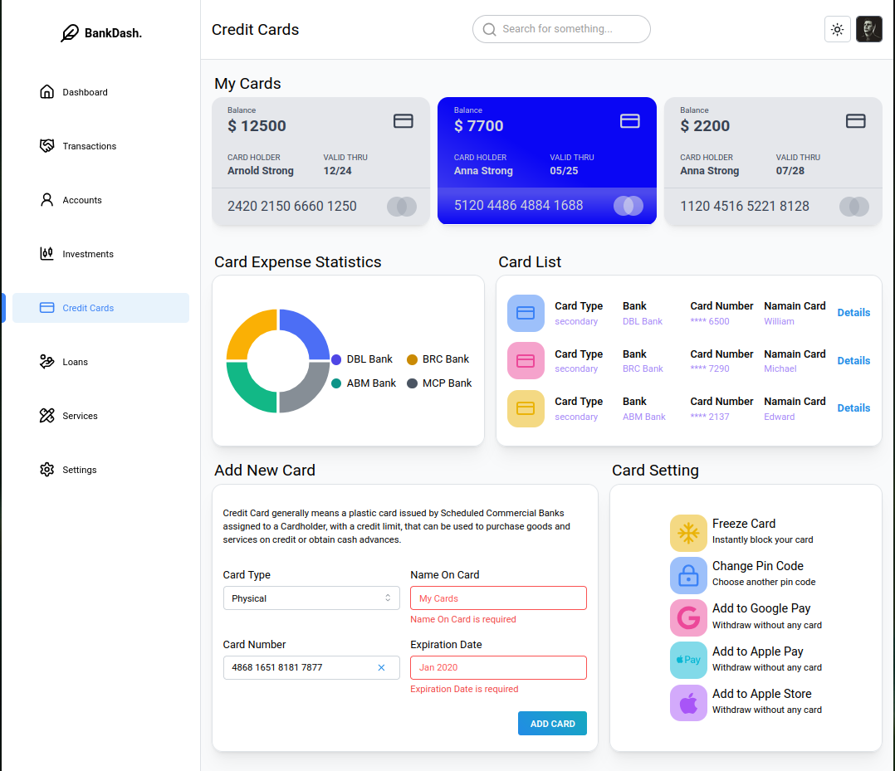

# BankDash: Banking Dashboard Simulation

A frontend-focused banking dashboard simulation built with **Remix v2** to explore dynamic data handling, responsive design and framework itself. Designed for learning purposes, not real-world banking.

| Info: |
| :--- |
|All financial data is generated client-side for demonstration.|
|Only single user avaiable - default credentials are: `mdawson98` / `password1234!`.|
|Design adapted from [Figma Template](https://www.figma.com/community/file/1323695683687017923) (made by [Seju](https://www.figma.com/@sejal_ui_ux)) with some modifications.|


Images of few routes:





## ✨ Features

- 🔐 Cookie-based authentication (single user without database)
- 📊 Interactive charts for financial data visualization
- 🔍 Filterable tables with URL search params
- 🌓 Light/dark theme toggle
- 🛠 Server-side form validation with Zod
- 💀 Loading skeletons and error boundaries
- 📁 Dynamic modals and notification system
- 🧩 Mocked API responses for transactions, balances, and user data

## 🛠 Tech Stack

- Language: TypeScript
- Framework: Remix v2 (Vite)
- Styling: TailwindCSS with Mantine components
- Validation: Zod


## Running server

### 1. Clone the repo

### 2. Install dependencies:
```bash
pnpm install
```

### 3. Start the dev server:
```bash
pnpm run dev
```

